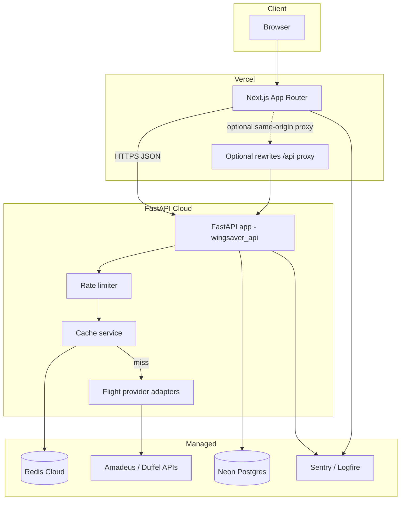
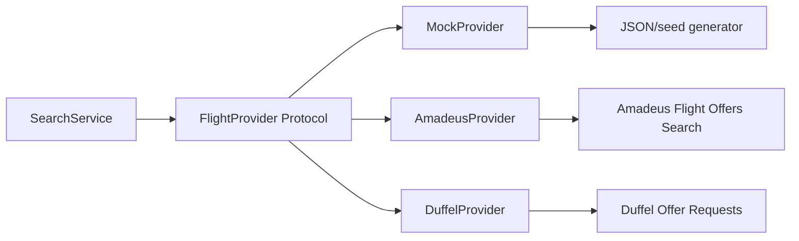
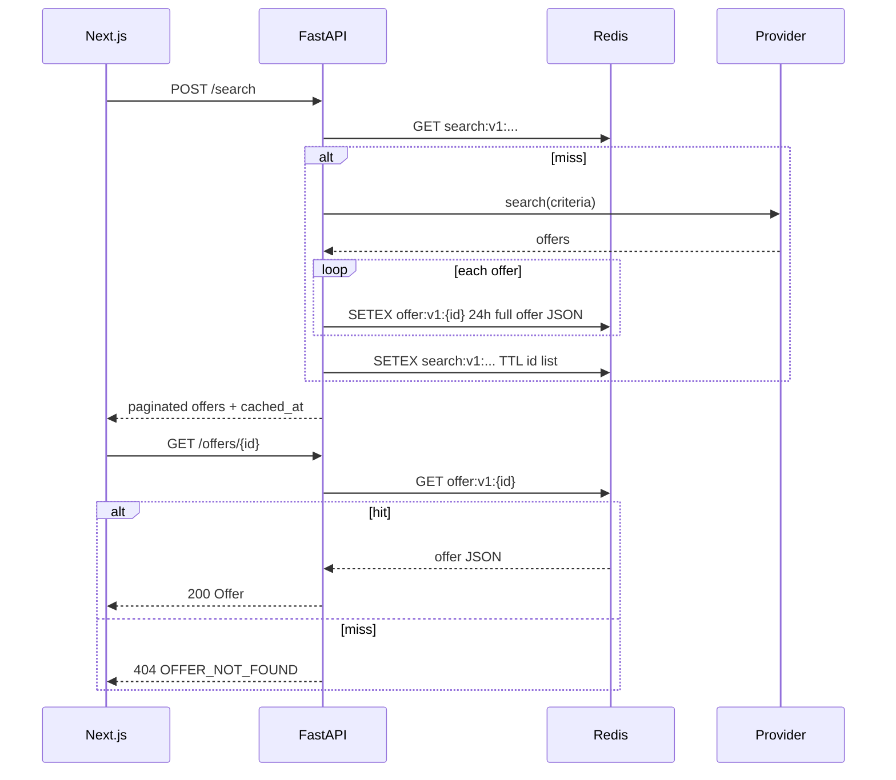
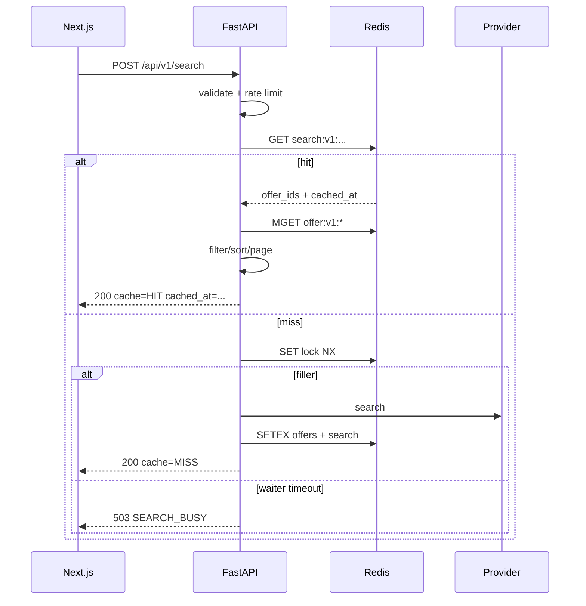
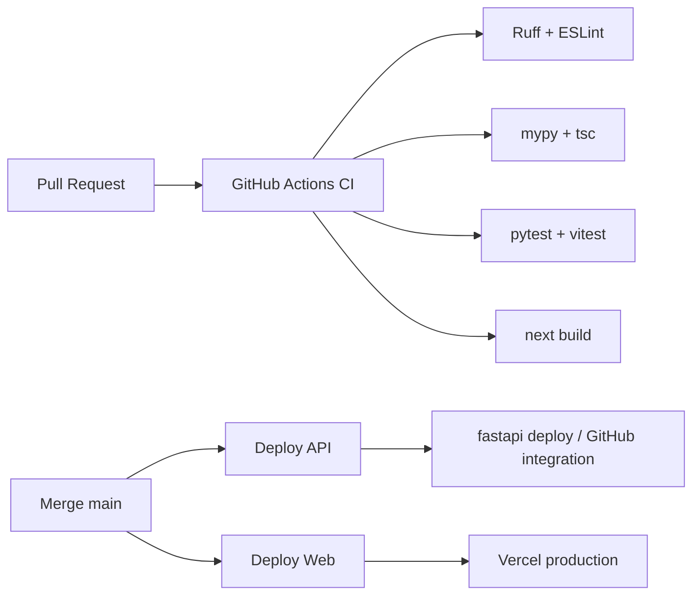

# WingSaver — Production Airline Search Platform Design

| Field | Value |
|-------|-------|
| **Document** | System Design — WingSaver Full-Stack Airline Search |
| **Author** | Engineering (placeholder) — assign named owner before leaving Draft |
| **Reviewers** | TBD (assign before implementation kickoff) |
| **Date** | 2026-08-01 |
| **Status** | Draft |
| **Target MVP milestone** | Mock search + results + detail + Redis cache deployable on FastAPI Cloud + Vercel (accounts/Amadeus post-MVP); target date TBD by product |
| **Success metrics owner** | TBD (product + eng lead); draft metrics: search success rate, p95 latency, provider error rate, cache hit ratio |
| **Workspace** | `/Users/sadnan/Documents/GitHub/WingSaver` (greenfield; empty `main`, no commits) |
| **Deploy targets** | Backend: [FastAPI Cloud](https://fastapicloud.com/); Frontend: [Vercel](https://vercel.com/) |
| **Revision** | 2026-08-01 r4 — product answers: invite-only registration, provider-native currency, post-MVP refresh revoke |

---

## Overview

WingSaver is a production-quality airline search product: users specify origin, destination, dates, passengers, and cabin class; the system returns filterable, sortable flight offers with detail views. The stack is **Python FastAPI** on the backend (deployed to **FastAPI Cloud**) and **React via Next.js App Router** on the frontend (deployed to **Vercel**).

This design defines a monorepo, adapter-based flight inventory (mock seed for MVP, Amadeus/Duffel for production), Redis-backed search caching, optional Postgres for accounts and saved searches, anonymous-first UX with optional JWT accounts, and full production concerns: config, CORS, rate limiting, observability, CI/CD, testing, and security. The repository is greenfield; all structure and patterns below are proposed from first principles, aligned with FastAPI Cloud and Vercel constraints (ephemeral instances, env/secrets, managed Neon/Redis integrations).

---

## Background & Motivation

### Current state

- Empty Git repository on `main` with no application code or commits.
- Product requirement: searchable flight inventory with production-grade API and modern web UX.
- Hard constraints: Python backend, React frontend, FastAPI Cloud + Vercel deploy paths.

### Pain points this design avoids

| Pain | Mitigation |
|------|------------|
| Vendor lock-in to a single flight API | Port/adapter pattern for inventory providers |
| Expensive, rate-limited third-party searches | Canonical cache keys + Redis TTL cache |
| Local-disk / in-process state on serverless | External Redis + Postgres only; no sticky sessions required for v1 search |
| CORS/env chaos across two hosts | Explicit CORS origins, env var matrices, secret marking |
| Unreviewable “big bang” PRs | Incremental PR plan with independently mergeable slices |

### Domain scope (v1)

- One-way and round-trip search (multi-city as stretch after v1).
- Passenger counts (adults/children/infants) and cabin class (economy / premium economy / business / first).
- Results list with filters (stops, airlines, price, duration) and sort (price, duration, departure).
- Offer/detail view (segments, layovers, baggage notes where available).
- Optional user accounts for saved searches (anonymous search works without login).

---

## Goals & Non-Goals

### Goals

1. Ship a deployable MVP: search → results → detail, with mock inventory and full API contract.
2. Production path for real inventory via Amadeus Self-Service or Duffel without rewriting API consumers.
3. Sub-second p50 for **cache-hit** searches; clear UX for multi-second cache-miss / provider latency.
4. Deploy backend with `fastapi deploy` and frontend with Vercel Git integration.
5. Structured logging, request IDs, health endpoints, Sentry (or Logfire) error tracking.
6. Automated CI (lint/typecheck/test) and staged CD.
7. Documented security posture: validation, secrets, rate limits, PII minimization.

### Non-Goals (v1)

- Booking, payment, or PNR creation (search-only).
- Airline GDS direct connectivity or NDC certification.
- Multi-tenancy / B2B white-label.
- Mobile native apps (responsive web only).
- Full multi-city itinerary builder (UI and product behavior deferred). Multi-city **API schema** is an **optional post-MVP stretch** only—not part of MVP definition of done (see PR 14).
- Real-time seat maps or ancillary pricing.
- GraphQL (REST + OpenAPI only for v1).
- **Client-side multi-currency / FX conversion** — v1 shows **provider-native currency only** (whatever mock/Amadeus returns). No FX rates, no display conversion.
- Affiliate / meta-search reseller models (Skyscanner, Kiwi Tequila, etc.): rejected for v1—ToS and UX constraints, weaker control of offer normalization, and poorer fit for a first-party shop experience.

---

## Key Decisions

| # | Decision | Choice | Rationale |
|---|----------|--------|-----------|
| 1 | Repository layout | **Monorepo** (`apps/api`, `apps/web`, `packages/*`) | Single PR can evolve API contract + FE client; shared OpenAPI types; simpler greenfield ops |
| 2 | Frontend framework | **Next.js App Router** on Vercel | First-class Vercel support, RSC for marketing/shell, client islands for search UX, rewrites/proxy options |
| 3 | Backend package layout | **`apps/api`** with `src/wingsaver_api`, `pyproject.toml`, `[tool.fastapi] entrypoint` | FastAPI Cloud expects `pyproject.toml` / `fastapi[standard]` and explicit entrypoint for non-root layouts |
| 4 | Flight data | **Adapter pattern**: Mock (MVP) → **Amadeus** primary for prod cutover; **Duffel = optional stretch (PR 13)**, not required for go-live | Mock unblocks FE/BE; Amadeus Self-Service has test env + Flight Offers Search; Duffel is alternate adapter only |
| 5 | Cache | **Redis** search results + **per-offer keys** via FastAPI Cloud Redis Cloud (`REDIS_URL`) | Search is expensive; ephemeral instances need shared cache; detail URLs require `offer:v1:{id}` store |
| 6 | Database | **Postgres (Neon pooled URL)** from accounts phase; **stateless search OK for pure MVP** | Neon first-party integration; use pooled conn string at runtime, direct for Alembic |
| 7 | Auth | **Anonymous search default**; optional accounts with **access JWT in memory + refresh JWT (`type=refresh`) in localStorage** (MVP); **invite-only registration at launch** (`AUTH_REGISTRATION_ENABLED=false`) | Cross-origin cookies painful Vercel↔API; signature-only refresh (no server revoke until **post-MVP**); safer early staging without public sign-up |
| 16 | Currency display | **Provider-native currency only** (no client FX) | Show amount/currency as returned by mock/Amadeus; no FX conversion in v1 |
| 17 | Refresh revoke store | **Post-MVP only** | MVP = signature-only refresh JWT; hashed refresh rows / revoke deferred until after MVP cutover |
| 8 | API style | **Versioned REST** `/api/v1/...` + unversioned `GET /health`; OpenAPI 3 | FastAPI native; FE typed client from OpenAPI |
| 9 | State management (FE) | **TanStack Query** + URL search params; **server-side filter/sort/page** | URL + POST body filters must match; API is source of truth for filtered results |
| 10 | Package managers | **uv** (Python), **pnpm** (JS) | FastAPI Cloud + `pyproject.toml` / `uv.lock`; pnpm workspaces |
| 11 | Observability | **structlog** + request IDs; **Sentry** both stacks before live provider; optional **Logfire** | Ship Sentry before Amadeus; Logfire optional via FastAPI Cloud |
| 12 | Rate limiting | **Custom Redis token bucket only** (no in-process SlowAPI storage) | Multi-instance safe; fail-open on Redis outage for search with metric alert (see §13) |
| 13 | Offer identity | **WingSaver-owned `{provider}_{ulid}`** + Redis `offer:v1:{id}`; GET Redis only | Upstream Amadeus ids are response-local and collide; display cache ≠ bookable fare |
| 14 | CD default | **GitHub Actions + `fastapi deploy`** with `FASTAPI_CLOUD_TOKEN` secret | Explicit v1 default; re-evaluate native GitHub integration later |
| 15 | Live cache TTL | **Provider-specific TTLs** (mock 15m, live 3m) + `cached_at` in response | Stale fares must not look “locked”; UX disclaimer |

---

## Proposed Design

### 1. System architecture



**Recommendation: monorepo** (not polyrepo) for greenfield dual-deploy:

- One CI graph, one OpenAPI contract source of truth.
- Independent deploy roots: FastAPI Cloud deploys from `apps/api` (or monorepo root with entrypoint/ignore rules); Vercel project root = `apps/web`.
- Polyrepo only if teams split and release cadence diverges later.

#### Proposed folder layout

```text
WingSaver/
├── .github/
│   └── workflows/
│       ├── ci.yml
│       ├── deploy-api.yml
│       └── deploy-web.yml
├── apps/
│   ├── api/                          # FastAPI backend (FastAPI Cloud root)
│   │   ├── pyproject.toml
│   │   ├── uv.lock
│   │   ├── .python-version           # e.g. 3.12
│   │   ├── .fastapicloudignore
│   │   ├── alembic.ini
│   │   ├── alembic/
│   │   ├── tests/
│   │   └── src/
│   │       └── wingsaver_api/
│   │           ├── __init__.py
│   │           ├── main.py           # app = create_app()
│   │           ├── config.py         # pydantic-settings
│   │           ├── dependencies.py
│   │           ├── logging.py
│   │           ├── middleware/
│   │           │   ├── request_id.py
│   │           │   └── timing.py
│   │           ├── api/
│   │           │   ├── router.py
│   │           │   └── v1/
│   │           │       ├── health.py
│   │           │       ├── search.py
│   │           │       ├── offers.py
│   │           │       ├── auth.py
│   │           │       └── users.py
│   │           ├── schemas/          # Pydantic request/response
│   │           ├── models/           # SQLAlchemy/SQLModel
│   │           ├── services/
│   │           │   ├── search.py
│   │           │   ├── cache.py
│   │           │   └── auth.py
│   │           ├── providers/
│   │           │   ├── base.py       # FlightProvider protocol
│   │           │   ├── mock.py
│   │           │   ├── amadeus.py
│   │           │   └── duffel.py
│   │           ├── db/
│   │           │   ├── session.py
│   │           │   └── redis.py
│   │           └── errors.py
│   └── web/                          # Next.js (Vercel root)
│       ├── package.json
│       ├── next.config.ts
│       ├── tsconfig.json
│       ├── playwright.config.ts
│       ├── public/
│       ├── src/
│       │   ├── app/                  # App Router
│       │   │   ├── layout.tsx
│       │   │   ├── page.tsx          # marketing / search entry
│       │   │   ├── search/
│       │   │   │   └── page.tsx
│       │   │   ├── flights/
│       │   │   │   └── [offerId]/
│       │   │   │       └── page.tsx
│       │   │   ├── account/
│       │   │   └── api/health/       # optional BFF health
│       │   ├── components/
│       │   ├── lib/
│       │   │   ├── api-client.ts
│       │   │   └── query-keys.ts
│       │   ├── hooks/
│       │   └── styles/
│       └── e2e/
├── packages/
│   └── openapi/                      # exported openapi.json + codegen scripts
├── docker-compose.yml                # local Postgres + Redis
├── pnpm-workspace.yaml
├── package.json                      # root scripts
├── .env.example
├── README.md
└── docs/
    └── design.md                     # this document (optional mirror)
```

**FastAPI Cloud deploy root:** Prefer setting the FastAPI Cloud project to `apps/api` so `pyproject.toml` is at the upload root. The `src/` layout requires an **installable package** so `wingsaver_api` imports without putting `src` in the entrypoint (per FastAPI Cloud docs).

```toml
# apps/api/pyproject.toml
[build-system]
requires = ["hatchling"]
build-backend = "hatchling.build"

[project]
name = "wingsaver-api"
version = "0.1.0"
requires-python = ">=3.12"
dependencies = [
  "fastapi[standard]>=0.115.0",
  "pydantic-settings>=2.0",
  "httpx>=0.27",
  "redis[hiredis]>=5.0",
  "sqlalchemy[asyncio]>=2.0",
  "asyncpg>=0.29",
  "alembic>=1.13",
  "PyJWT[crypto]>=2.8",
  "pwdlib[argon2]>=0.2.0",
  "structlog>=24.0",
  "sentry-sdk[fastapi]>=2.0",
]

[dependency-groups]
dev = [
  "pytest>=8.0",
  "pytest-asyncio>=0.24",
  "ruff>=0.6",
  "mypy>=1.11",
  "respx>=0.21",
  "fakeredis[lua]>=2.23",
]

[tool.hatch.build.targets.wheel]
packages = ["src/wingsaver_api"]

[tool.hatch.build.targets.wheel.sources]
"src/wingsaver_api" = "wingsaver_api"

[tool.fastapi]
entrypoint = "wingsaver_api.main:app"
```

**Acceptance criterion (PR 1/2):** `cd apps/api && uv sync && uv run fastapi dev` serves OpenAPI at `/openapi.json` **without** `PYTHONPATH=src` and without passing a file path. `uv run python -c "from wingsaver_api.main import app"` must succeed.

If the monorepo root is uploaded instead, configure entrypoint carefully and use `.fastapicloudignore` to exclude `apps/web`, `node_modules`, etc. **Recommendation:** deploy API from `apps/api` only.

**Service boundaries (logical):**

| Boundary | Responsibility |
|----------|----------------|
| API gateway layer | Auth middleware, rate limit, request ID, CORS |
| Search service | Normalize criteria, cache get/set, call provider, map to domain offers |
| Provider adapters | External HTTP, auth to Amadeus/Duffel, map DTOs |
| User service | Register/login, saved searches CRUD |
| Persistence | Postgres for users/saved searches; Redis for cache + rate limits |

No separate microservices in v1—single FastAPI process, modular packages.

---

### 2. Backend design (FastAPI)

#### App factory and lifespan

```python
# apps/api/src/wingsaver_api/main.py
from contextlib import asynccontextmanager
from fastapi import FastAPI
from fastapi.middleware.cors import CORSMiddleware

from wingsaver_api.config import get_settings
from wingsaver_api.db.redis import create_redis_pool, close_redis_pool
from wingsaver_api.db.session import init_engine, dispose_engine
from wingsaver_api.api.router import api_router
from wingsaver_api.middleware.request_id import RequestIdMiddleware
from wingsaver_api.logging import configure_logging
from wingsaver_api.errors import register_exception_handlers

@asynccontextmanager
async def lifespan(app: FastAPI):
    settings = get_settings()
    configure_logging(settings)
    # Lazy-friendly: create pools at startup of each instance; close on shutdown
    if settings.redis_url:
        app.state.redis = await create_redis_pool(settings.redis_url)
    if settings.database_url:
        init_engine(settings.database_url)
    yield
    await close_redis_pool(getattr(app.state, "redis", None))
    await dispose_engine()

def create_app() -> FastAPI:
    settings = get_settings()
    settings.validate_runtime()  # fail-closed production boot checks
    app = FastAPI(
        title="WingSaver API",
        version="1.0.0",
        lifespan=lifespan,
        docs_url="/docs" if settings.environment != "production" else None,
        redoc_url=None,
    )
    app.add_middleware(RequestIdMiddleware)
    # CORS: exact origins list + optional regex for Vercel previews (see §9).
    # Do NOT combine allow_credentials=True with reflected arbitrary Origin.
    cors_kwargs: dict = {
        "allow_origins": settings.cors_origins,
        "allow_credentials": True,
        "allow_methods": ["GET", "POST", "PUT", "PATCH", "DELETE", "OPTIONS"],
        "allow_headers": ["Authorization", "Content-Type", "X-Request-ID"],
        "expose_headers": ["X-Request-ID", "X-RateLimit-Remaining", "X-Cache"],
    }
    if settings.cors_origin_regex:
        cors_kwargs["allow_origin_regex"] = settings.cors_origin_regex
    app.add_middleware(CORSMiddleware, **cors_kwargs)
    register_exception_handlers(app)
    # Unversioned liveness for platform/uptime probes
    @app.get("/health", tags=["health"])
    async def root_health():
        return {"status": "ok"}
    app.include_router(api_router, prefix="/api")
    return app

app = create_app()
```

#### Configuration (`pydantic-settings`)

```python
# apps/api/src/wingsaver_api/config.py
from functools import lru_cache
from typing import Literal
from pydantic import Field, field_validator
from pydantic_settings import BaseSettings, SettingsConfigDict

class Settings(BaseSettings):
    model_config = SettingsConfigDict(env_file=".env", extra="ignore")

    environment: Literal["local", "staging", "production"] = "local"
    log_level: str = "INFO"

    # Neon: use *pooled* URL for app runtime (PgBouncer); optional direct for migrations
    database_url: str | None = Field(default=None, validation_alias="DATABASE_URL")
    database_url_direct: str | None = Field(default=None, validation_alias="DATABASE_URL_DIRECT")
    redis_url: str | None = Field(default=None, validation_alias="REDIS_URL")

    cors_origins: list[str] = Field(default_factory=lambda: ["http://localhost:3000"])
    # Vercel preview regex; empty string disables. See §9.
    cors_origin_regex: str | None = None

    flight_provider: Literal["mock", "amadeus", "duffel"] = "mock"
    amadeus_client_id: str | None = None
    amadeus_client_secret: str | None = None
    amadeus_hostname: Literal["test", "production"] = "test"
    duffel_access_token: str | None = None

    # No insecure default in production — validate_runtime enforces
    jwt_secret: str = "dev-only-change-me"
    jwt_access_ttl_minutes: int = 30
    jwt_refresh_ttl_days: int = 7  # absolute lifetime for MVP refresh tokens

    search_cache_ttl_seconds_mock: int = 900   # 15 min
    search_cache_ttl_seconds_live: int = 180   # 3 min for Amadeus/Duffel
    offer_cache_ttl_seconds: int = 86400       # 24h deep-link window (MVP decision)
    rate_limit_search_per_minute: int = 30
    rate_limit_fail_open: bool = True  # if Redis down, allow traffic + alert
    http_timeout_seconds: float = 25.0
    # Proxy trust: verify hop count on first FastAPI Cloud staging deploy
    trusted_proxy_hops: int = 1  # untrusted until platform XFF behavior verified

    db_pool_size: int = 5
    db_max_overflow: int = 5
    redis_max_connections: int = 20

    sentry_dsn: str | None = None
    # Invite-only at launch (product decision). Set true when product opens public sign-up.
    auth_registration_enabled: bool = False

    @field_validator("cors_origins", mode="before")
    @classmethod
    def parse_cors(cls, v):
        if isinstance(v, str):
            return [o.strip() for o in v.split(",") if o.strip()]
        return v

    def search_cache_ttl(self) -> int:
        if self.flight_provider == "mock":
            return self.search_cache_ttl_seconds_mock
        return self.search_cache_ttl_seconds_live

    def validate_runtime(self) -> None:
        """Fail closed on production misconfiguration (called from create_app)."""
        if self.environment != "production":
            return
        if self.jwt_secret in {"dev-only-change-me", "change-me-in-production"} or len(self.jwt_secret) < 32:
            raise RuntimeError("JWT_SECRET must be a strong secret (>=32 chars) in production")
        if not self.redis_url:
            raise RuntimeError("REDIS_URL required in production (cache + rate limits)")
        if self.flight_provider == "amadeus" and not (self.amadeus_client_id and self.amadeus_client_secret):
            raise RuntimeError("Amadeus credentials required when FLIGHT_PROVIDER=amadeus")
        if self.flight_provider == "duffel" and not self.duffel_access_token:
            raise RuntimeError("DUFFEL_ACCESS_TOKEN required when FLIGHT_PROVIDER=duffel")
        if not self.cors_origins and not self.cors_origin_regex:
            raise RuntimeError("CORS_ORIGINS or CORS_ORIGIN_REGEX required in production")

@lru_cache
def get_settings() -> Settings:
    return Settings()
```

**Note:** On FastAPI Cloud, set secrets with `fastapi cloud env set --secret` or dashboard “Secret” toggle so provider keys and `JWT_SECRET` are encrypted at rest.

#### Dependency injection

```python
# dependencies.py (illustrative)
from fastapi import Depends, Request
from redis.asyncio import Redis
from sqlalchemy.ext.asyncio import AsyncSession

async def get_redis(request: Request) -> Redis:
    redis = getattr(request.app.state, "redis", None)
    if redis is None:
        raise RuntimeError("Redis not configured")
    return redis

async def get_db() -> AsyncSession: ...

def get_flight_provider(settings: Settings = Depends(get_settings)) -> FlightProvider: ...

async def get_current_user_optional(...) -> User | None: ...
async def get_current_user_required(...) -> User: ...
```

#### Async HTTP clients

- Use **httpx.AsyncClient** as a shared client on `app.state.http` (created in lifespan) with timeouts from settings.
- Never create unbounded clients per request.
- Provider adapters receive the client via DI.

#### Error model

**Decision:** All client errors use a **unified envelope**. Request-body validation uses **HTTP 422** (FastAPI/Pydantic default status) but is **wrapped** into the same JSON shape as domain errors (override `RequestValidationError` handler). Do **not** use bare FastAPI 422 body or a separate 400 path for schema validation. Domain business-rule failures that are not schema issues (e.g. return before depart after custom check) also use **422** with `code: VALIDATION_ERROR`. Reserve **400** only if we later add non-validation bad requests; v1 FE can treat 422 as “fix errors.”

Unified JSON error body (always):

```json
{
  "error": {
    "code": "SEARCH_PROVIDER_UNAVAILABLE",
    "message": "Upstream flight provider timed out",
    "request_id": "01JXYZ...",
    "details": {}
  }
}
```

| HTTP | Code examples |
|------|----------------|
| 401 | `UNAUTHORIZED` |
| 403 | `FORBIDDEN` |
| 404 | `OFFER_NOT_FOUND` |
| 409 | `CONFLICT` |
| 422 | `VALIDATION_ERROR` (schema + domain validation; `details` = field errors) |
| 429 | `RATE_LIMITED` |
| 502 | `SEARCH_PROVIDER_ERROR` |
| 503 | `SEARCH_PROVIDER_UNAVAILABLE`, `SEARCH_BUSY` (stampede timeout) |
| 500 | `INTERNAL_ERROR` (no stack traces to clients) |

Map domain exceptions in `register_exception_handlers`. FE `toApiError` parses only this envelope.

#### Validation

- All public inputs via Pydantic models: IATA codes `^[A-Z]{3}$`, date ranges (return ≥ depart), passenger totals ≥ 1, infants ≤ adults.
- Reject unknown cabin classes with enum.
- Cap page size (e.g. max 50).

#### OpenAPI

- FastAPI auto-generates OpenAPI at `/openapi.json`.
- CI job exports schema to `packages/openapi/openapi.json` and fails if FE client is stale (optional drift check).
- Tag groups: `health`, `search`, `offers`, `auth`, `users`.

---

### 3. Flight data strategy



#### Protocol (domain port)

```python
# providers/base.py
from typing import Protocol
from wingsaver_api.schemas.search import SearchCriteria
from wingsaver_api.schemas.offer import Offer

class FlightProvider(Protocol):
    async def search(self, criteria: SearchCriteria) -> list[Offer]:
        """Return normalized offers for the given criteria.

        Implementations return provider-native DTOs or partial offers; the SearchService
        assigns WingSaver-owned public offer ids (see Offer identity). Adapters MUST NOT
        use raw upstream ids as public Offer.id.
        get_offer is NOT part of the port for v1 — detail is served from Redis offer store only.
        """
        ...
```

Normalized `Offer` fields (provider-agnostic):

- `id` — **WingSaver-owned opaque id**, never a raw Amadeus/Duffel response-local id. Format: `{provider}_{ulid}` (preferred) e.g. `amadeus_01J8Z3…`, `mock_01J8Z3…`, `duffel_01J8Z3…`. Prefix is for debugging only; uniqueness comes from ULID (or equivalent). **Redis keys never use raw upstream ids.**
- `provider` (`mock` | `amadeus` | `duffel`)
- `price` (`amount` decimal string, `currency`)
- `cabin_class`, `validating_airline`
- `slices[]` (outbound/inbound): `segments[]` with origin, destination, depart_at, arrive_at, marketing_carrier, flight_number, duration_minutes; slice-level `stops`, `duration_minutes`
- `baggage_summary` (optional)
- `provider_payload` (optional, **server-only**, never in public OpenAPI response) — full upstream offer JSON including Amadeus’s response-local `id` for future Flight Offers Price; strip before serializing to clients
- `expires_at` (ISO timestamp when our Redis offer key will expire)

#### Offer identity & detail lifecycle (MVP decision)

| Concern | MVP decision |
|---------|----------------|
| Public offer id | **Always assigned by WingSaver** on normalize after provider search: `{provider}_{ulid}`. Upstream Amadeus/Duffel ids live only inside `provider_payload` (server-only). |
| Why not `amadeus_{upstreamId}` | Amadeus Flight Offers Search ids are **response-local** (often `"1"`, `"2"`). Two searches within offer TTL would collide on `offer:v1:amadeus_1` and overwrite detail payloads. |
| Search cache key | `search:v1:{provider}:{sha256(canonical_criteria)}` → list of **WingSaver offer IDs** (+ optional compact summary for list cards). See §4 for what is **excluded** from the hash. |
| Offer store | On every search **miss fill**, `SETEX offer:v1:{wingsaver_offer_id}` for each offer with `OFFER_CACHE_TTL_SECONDS` (**24h** default) |
| `GET /offers/{offer_id}` | **Redis GET only**. No Amadeus/Duffel re-fetch by id. 404 → `OFFER_NOT_FOUND` + FE “Search again” |
| Deep links | Shareable for up to offer TTL (24h), independent of shorter search-list TTL |
| Booking (future) | Must call Amadeus **Flight Offers Price** with stored `provider_payload` (server-side); search cache is **display-only**, not a price lock |
| Mock IDs | Also use `{provider}_{ulid}` (or deterministic ULID-from-seed only if tests need stable ids—prefer ULID + fixture injection). Never rely on rank alone for Redis keys in multi-search scenarios |
| Required unit test | Two fixture Amadeus responses both containing upstream `"id": "1"` must produce **distinct** `offer:v1:*` keys and correct independent detail payloads |



#### Options comparison

| Option | Pros | Cons | When |
|--------|------|------|------|
| **Mock + seed** | Free, deterministic tests, offline | Not real inventory | MVP, CI, local |
| **Amadeus Self-Service** | Mature Flight Offers Search, test host | OAuth, quotas, mapping, commercial approval for prod | Production default |
| **Duffel** | Clean modern API | Access/pricing; **stretch only** | PR 13 optional; not required for prod cutover |
| **Aviationstack / schedule APIs** | Flight schedules | Not shoppable priced offers | Reject for shop UX |
| **Skyscanner / Kiwi affiliate** | Fast meta inventory | ToS, branding, weak control of normalization | Reject for v1 first-party product |

#### Recommendation

1. **MVP / default:** `FLIGHT_PROVIDER=mock` + Redis offer store when Redis is available; in-memory offer map only for local without Redis.
2. **Production cutover:** `FLIGHT_PROVIDER=amadeus` (test host first, then production). **Duffel is not required for go-live** (PR 13 stretch).
3. **Never** call providers from the frontend; keys only on FastAPI Cloud secrets.

#### Amadeus adapter contract (implementable)

**Auth (OAuth2 client credentials)**

| Item | Value |
|------|--------|
| Token URL (test) | `https://test.api.amadeus.com/v1/security/oauth2/token` |
| Token URL (prod) | `https://api.amadeus.com/v1/security/oauth2/token` |
| Grant | `client_credentials` with `AMADEUS_CLIENT_ID` / `AMADEUS_CLIENT_SECRET` |
| Token cache key | `amadeus:token:{hostname}` in Redis |
| Token TTL | Use `expires_in` from response minus 60s skew; refresh on 401 once |
| Host selection | `AMADEUS_HOSTNAME=test\|production` → base `https://test.api.amadeus.com` or `https://api.amadeus.com` |

**Search endpoint (v1 only)**

- `GET /v2/shopping/flight-offers` with query params mapped from `SearchCriteria`:
  - `originLocationCode`, `destinationLocationCode`, `departureDate`, `returnDate` (if round-trip), `adults`, `children`, `infants`, `travelClass` (ECONOMY, PREMIUM_ECONOMY, BUSINESS, FIRST), `currencyCode`, `max` (≤50).
- Do **not** implement Flight Offers Price or order APIs in v1 (booking non-goal).

**Field mapping (Amadeus → Offer)**

| Amadeus | WingSaver Offer |
|---------|-----------------|
| `id` (response-local, e.g. `"1"`) | **Do not use as public id.** Store inside `provider_payload` only. Public `Offer.id` = `amadeus_{ulid}` assigned by SearchService |
| `price.grandTotal` / `price.currency` | `price.amount` / `price.currency` |
| `validatingAirlineCodes[0]` | `validating_airline` |
| `travelerPricings[0].fareDetailsBySegment[*].cabin` | map to `cabin_class` (first segment or dominant) |
| `itineraries[]` | `slices[]` (index 0 outbound, 1 return) |
| `itineraries[].duration` (ISO-8601 e.g. `PT7H15M`) | parse → `duration_minutes` |
| `itineraries[].segments[]` | `segments[]` |
| `segments[].departure.iataCode` / `.at` | `origin` / `depart_at` |
| `segments[].arrival.iataCode` / `.at` | `destination` / `arrive_at` |
| `segments[].carrierCode` + `number` | `marketing_carrier`, `flight_number` |
| `segments[].duration` | segment `duration_minutes` |
| len(segments)-1 | slice `stops` |
| full offer object | store as server-only `provider_payload` for future pricing |

**Error taxonomy**

| Upstream | API result |
|----------|------------|
| 401 after token refresh fail | 503 `SEARCH_PROVIDER_UNAVAILABLE` |
| 429 Amadeus | 503 `SEARCH_PROVIDER_UNAVAILABLE` + Retry-After if present; metric `provider.rate_limited` |
| 4xx validation from Amadeus | 502 `SEARCH_PROVIDER_ERROR` (log body; don’t leak raw upstream to client) |
| Empty `data: []` | 200 with `total: 0` offers (not an error) |
| Timeout / network | 503 `SEARCH_PROVIDER_UNAVAILABLE` |
| Unsupported cabin edge cases | Map best-effort; drop offer if unmappable; log warning |

**Fixtures:** Commit golden JSON under `apps/api/tests/fixtures/amadeus/one_way_jfk_lhr.json` and `round_trip_jfk_lhr.json`; tests map with `respx` mocking HTTP—no live calls in CI.

**Commercial risk:** Production Self-Service requires Amadeus account approval/billing beyond free test tier; treat as launch dependency (see Risks).

#### Mock data design

- Deterministic RNG seeded by cache key hash → stable results for same query.
- 8–40 offers per search; vary stops, duration, price.
- Load airport metadata from static JSON (IATA → city/name) bundled in package.

---

### 4. Caching strategy

Search is the expensive path. Cache **raw provider offer ID lists** (pre-filter) and **full offer documents** in Redis. Live fares use a shorter TTL than mock (see Key Decision #15).

#### Cache keys

```text
search:v1:{provider}:{sha256(canonical_json(trip_identity))}  → { "cached_at": "...", "offer_ids": ["amadeus_01J…", …] }
offer:v1:{wingsaver_offer_id}                                → full Offer JSON (WingSaver id only; never raw upstream id)
lock:search:v1:{provider}:{hash}                             → stampede lock
amadeus:token:{hostname}                                     → OAuth access token
rl:{bucket}:{identity}:{window}                              → rate-limit counters
```

**Canonical trip identity (cache key material) — include only:**

| Included in hash | Excluded from hash (never) |
|------------------|----------------------------|
| `provider` | `filters` (max_stops, airlines, max_price, …) |
| `trip_type` | `sort` |
| `origin`, `destination` | `page` |
| `departure_date`, `return_date` (if any) | `page_size` |
| `passengers` (adults/children/infants) | Any UI-only fields |
| `cabin_class`, `currency` | |

Canonicalization: sorted keys, uppercased IATA, ISO dates, integer passengers, enum cabin. Example:

```json
// HASHED (trip identity)
{"cabin_class":"economy","currency":"USD","departure_date":"2026-09-10","destination":"LHR","origin":"JFK","passengers":{"adults":1,"children":0,"infants":0},"provider":"mock","return_date":"2026-09-20","trip_type":"round_trip"}

// NOT HASHED — applied on read from the same search:v1 key
{"filters":{"max_stops":1},"sort":"price_asc","page":2,"page_size":20}
```

**Required unit tests:** (1) two POST bodies that differ only in `filters`/`sort`/`page`/`page_size` produce the **same** search cache key; (2) changing `origin` or `departure_date` produces a different key.

#### Provider-specific TTLs & fare truthfulness

| Setting | Default | Notes |
|---------|---------|-------|
| `SEARCH_CACHE_TTL_SECONDS_MOCK` | 900 (15m) | Cost/demo friendly |
| `SEARCH_CACHE_TTL_SECONDS_LIVE` | 180 (3m) | Reduces stale Amadeus/Duffel prices |
| `OFFER_CACHE_TTL_SECONDS` | 86400 (24h) | Deep-link window; prices still **not guaranteed** |
| Response fields | `cache: HIT\|MISS`, `cached_at` (ISO), `stale: false` | `stale` reserved true if we ever serve past soft-TTL |
| UX copy | “Prices are estimates and may change before booking.” | Required on results + detail even though booking is non-goal |
| Headers | `X-Cache: HIT\|MISS` | For debugging |

Authenticated “refresh fares” (bypass cache) is **out of scope for v1**; document as future query flag `?fresh=1`.

#### Stampede lock algorithm (complete)

1. On search miss, try `SET lock:search:… NX PX 30000` (30s).
2. **Lock acquired (filler):** call provider; write offer keys + search key; `DEL` lock; return.
3. **Lock not acquired (waiter):** poll search key every 50–100ms with exponential backoff, max **2.5s** total. If key appears → serve HIT. If timeout → return **503** `SEARCH_BUSY` with `Retry-After: 1` (do **not** all stampede the provider).
4. If filler dies before write, lock TTL expires; one waiter may become next filler.
5. Cap concurrent provider searches globally: Redis counter `provider:inflight` with max **20** (config); excess → 503 `SEARCH_BUSY`.

#### Search flow



| Setting | Value | Notes |
|---------|-------|-------|
| Search value | JSON list of offer IDs + `cached_at` | Not full blobs in search key |
| Offer value | gzip JSON, cap **~8 KB** public offer; max **50 offers** per search | Evict by TTL only; no LRU required for v1 |
| Negative cache | 60s on provider 5xx for that criteria key | Empty string / sentinel `{"error":true}` |

#### Capacity / cost napkin math

| Assumption | Value |
|------------|-------|
| Max offers per search | 50 |
| Public offer JSON size | ~2–5 KB (avg 3.5 KB) |
| Offer store per search | ≤ 50 × 5 KB ≈ **250 KB** (+ search key negligible) |
| Unique searches/day (MVP) | 5,000 (illustrative) |
| Live TTL 3m / mock 15m | Working set dominated by concurrent unique queries, not full day |
| Redis memory ceiling (MVP) | Plan **≤ 256 MB** free-tier friendly: e.g. 1,000 concurrent cached searches × 250 KB = 250 MB worst case → **enforce max 50 offers** and prefer storing list summaries if pressure |
| Amadeus free/test tier | Often low thousands of calls/month—rate limit 30/min/IP + cache hit ratio target **≥ 40%** after warm traffic to stay under quota |
| Provider calls | 1 per search miss (plus rare OAuth token) |

#### FastAPI Cloud / Redis assumptions

| Topic | Fact / assumption | Design implication |
|-------|-------------------|--------------------|
| Redis integration | FastAPI Cloud → Redis Cloud; injects `REDIS_URL` | `redis.asyncio.from_url` pool `max_connections=20` |
| Neon | Injects `DATABASE_URL`; prefer **pooled** endpoint | See §5 |
| Deploy model | `pyproject.toml` / lockfile; `fastapi deploy` | Lean deps; installable src package |
| Instances | Ephemeral / horizontally scalable | No in-process cache/rate limit as sole path |
| Cold starts | Possible | Small package; pools in lifespan |
| Connection limits | Finite Redis/Postgres | Small pools; see §5 math |
| Env / secrets | Dashboard / `fastapi cloud env set --secret` | Encrypt keys |
| X-Forwarded-For | **Not independently verified** for hop count | `trusted_proxy_hops=1` until staging verifies |

**Fallback when Redis is unset:** local/dev only — in-process LRU for search + offers with warning. **Production:** `validate_runtime()` refuses boot without `REDIS_URL` (fail closed). Ready endpoint also 503 if Redis PING fails.

---

### 5. Database

#### When is DB required?

| Feature | Needs Postgres? |
|---------|-----------------|
| Anonymous flight search | No |
| Cached results + offers | Redis only |
| Saved searches, search history | Yes |
| User accounts | Yes |
| Refresh-token revocation | **Post-MVP** (MVP: signature-only refresh JWT, no server store) |

**v1 recommendation:**

- **Phase A (search MVP):** No Postgres; mock provider + Redis required for staging/prod.
- **Phase B (accounts):** Neon Postgres via FastAPI Cloud integration; SQLAlchemy 2.0 async + asyncpg.

#### Neon connection strategy (ephemeral instances)

| Concern | Spec |
|---------|------|
| Runtime URL | Neon **pooled** connection string (PgBouncer, often host contains `-pooler`) as `DATABASE_URL` |
| Migrations URL | Neon **direct** (non-pooler) as `DATABASE_URL_DIRECT` for Alembic only |
| SSL | `ssl=require` (asyncpg: `connect_args` / URL query `sslmode=require`) — Neon requires TLS |
| Pool per instance | `pool_size=5`, `max_overflow=5` → ≤ **10** conns per app instance |
| Instance math | e.g. 5 FastAPI Cloud instances × 10 = **50** conns; stay under Neon plan limit (free often ~100). Prefer fewer instances or `pool_size=3` if limited |
| NullPool | Optional for extreme serverless if connection churn is high; default is **async queue pool** with small size for FastAPI long-lived workers |
| Startup | Create engine in lifespan; dispose on shutdown; no migrate-on-boot |

```python
# illustrative
engine = create_async_engine(
    settings.database_url,  # pooled
    pool_size=settings.db_pool_size,
    max_overflow=settings.db_max_overflow,
    pool_pre_ping=True,
)
# alembic env.py uses settings.database_url_direct or DATABASE_URL_DIRECT
```

#### Schema (Phase B)

```text
users
  id            UUID PK
  email         CITEXT UNIQUE NOT NULL
  password_hash TEXT NOT NULL
  created_at    TIMESTAMPTZ
  updated_at    TIMESTAMPTZ

refresh_tokens  -- POST-MVP only (not MVP schema). Server-side revoke deferred until after MVP cutover.
  id            UUID PK
  user_id       UUID FK
  token_hash    TEXT UNIQUE
  expires_at    TIMESTAMPTZ
  revoked_at    TIMESTAMPTZ NULL

saved_searches
  id            UUID PK
  user_id       UUID FK users ON DELETE CASCADE
  label         TEXT NULL
  criteria_json JSONB NOT NULL
  created_at    TIMESTAMPTZ
```

Migrations: **Alembic** under `apps/api/alembic`. CI against ephemeral Postgres; production via release job (`alembic upgrade head` with direct URL)—**never** auto-migrate on cold start.

---

### 6. Auth

#### Choice: anonymous-first + optional JWT

**Why not session cookies only?** Cross-origin Vercel ↔ FastAPI Cloud makes httpOnly cookie refresh (SameSite=None; Secure; domain split) error-prone and CSRF-sensitive. Defer BFF cookie sessions to a later revision.

**Why not force accounts?** Flight search is top-of-funnel; auth wall kills conversion. Accounts only for saved searches.

#### MVP token storage (single chosen path)

| Token | Storage | Lifetime | Notes |
|-------|---------|----------|-------|
| Access JWT | **In-memory only** (React state / module var) | 30 min | Not in `localStorage`; lost on full page refresh → silent refresh |
| Refresh token | **`localStorage`** key `ws_refresh` | **7 days absolute (`exp`)** | **MVP format: JWT HS256** with claims `type=refresh`, `sub`, `exp` (and optionally `jti`). Verified only by signature + `type` + `exp`—**no server-side store or revoke in MVP**. XSS can steal—mitigate with CSP, short absolute TTL |
| Logout | Delete memory access + `localStorage` refresh | Immediate client-side | **MVP has no server-side refresh revoke** (product: defer revoke store until **post-MVP**). Stolen refresh works until `exp`. |

**Registration (product decision):** **Invite-only at launch.** Default `AUTH_REGISTRATION_ENABLED=false` for staging and production until product opens public sign-up. When false, `POST /auth/register` returns **403** `FORBIDDEN` (or 404) with message that registration is closed; seed/admin invite path is ops-only (out of band). Anonymous search remains fully available.

**Rejected for MVP:** cross-origin httpOnly cookies; dual opaque-vs-JWT ambiguity; opaque random tokens without a store (unverifiable); public open registration.

**Post-MVP (not MVP):** (1) Server-side refresh revoke store (opaque tokens hashed in Postgres/Redis). (2) Optional BFF httpOnly cookies. (3) Flip `AUTH_REGISTRATION_ENABLED=true` when opening sign-up.

#### Flow

```mermaid
sequenceDiagram
  participant U as User
  participant FE as Next.js
  participant API as FastAPI

  U->>FE: Search without login
  FE->>API: POST /search (no auth)
  API-->>FE: offers

  U->>FE: Sign up / login
  FE->>API: POST /auth/register or /auth/login
  API-->>FE: access_token + refresh_token + expires_in
  FE->>FE: access in memory; refresh in localStorage

  Note over FE: On reload or 401
  FE->>API: POST /auth/refresh {refresh_token}
  API-->>FE: new access_token (+ optional rotated refresh)

  U->>FE: Save search
  FE->>API: POST /users/me/saved-searches Bearer access
  API-->>FE: 201
```

- **Access token:** JWT HS256 via **PyJWT**, 30 min, claims: `sub`, `email`, `exp` (and `type=access` optional).
- **Refresh token (MVP — single choice):** JWT HS256 via **PyJWT**, 7d `exp`, claims: `type=refresh`, `sub`, `exp` (optional `jti` for future denylist). `POST /auth/refresh` verifies signature, `type==refresh`, and `exp`; issues new access JWT (and may rotate refresh by minting a new refresh JWT). **No Redis/Postgres lookup in MVP.** **Server-side revoke is post-MVP** (product decision)—do not implement `refresh_tokens` table or denylist until after MVP cutover.
- **Password hashing:** **argon2** via `pwdlib[argon2]` (not passlib/bcrypt).
- **Registration:** `AUTH_REGISTRATION_ENABLED` defaults **`false`** (invite-only at launch). Implementers must keep this false in staging/production env until product enables public sign-up.

---

### 7. Frontend design

#### Next.js App Router vs Vite SPA

| | Next.js App Router | Vite SPA |
|--|--------------------|----------|
| Vercel fit | Native, previews, analytics | Works as static |
| SEO / landing | Strong | Extra work |
| API proxy | `rewrites` / Route Handlers | Need separate CORS only |
| Complexity | Higher | Lower |

**Decision: Next.js App Router** on Vercel.

#### UX structure

- **Home:** Search form (origin/destination typeahead from static airport list, trip type, dates, passengers, cabin).
- **Search results:** URL-driven (`/search?from=JFK&to=LHR&depart=2026-09-01&return=2026-09-15&adults=1&cabin=economy&sort=price_asc&stops=0,1&page=1`). URL params map 1:1 into the POST body.
- **Filters / sort / page (mandatory model):** **Server-side only** on the public API. Cache stores **pre-filter** raw provider set; on each request API applies `filters` / `sort` / `page` / `page_size` then returns the page. FE must **not** re-filter a full unfiltered set as source of truth. Optimistic UI may hide cards already on the current page, but changing filters always re-POSTs to API.
- **Offer detail:** `/flights/[offerId]` → `GET /api/v1/offers/{id}` from Redis offer store. On 404 after TTL: “This offer expired. Search again.” Show price disclaimer.
- **Loading:** Skeleton cards; cancel in-flight query on criteria change (TanStack Query).
- **Empty:** Explicit empty state with suggestions (flexible dates CTA later).
- **Error:** Toast + inline panel with request ID; parse unified error envelope.
- **Fare disclaimer:** Results and detail always show: prices are estimates and may change before booking.
- **Currency:** Display `price.amount` + `price.currency` exactly as returned by the API (**provider-native only**). No FX conversion UI, no “show in USD” toggle in v1.
- **a11y:** Labelled inputs, keyboard date picker (or native), focus management on results region (`aria-live="polite"`), color contrast WCAG AA, don’t rely on color alone for stops.

#### State management

- **URL search params** = source of truth for criteria/filters.
- **TanStack Query** for server state (`useSearchFlights`, `useOffer`).
- **Zustand** only for ephemeral UI (passenger popover open, mobile filter drawer).

#### API client

```typescript
// apps/web/src/lib/api-client.ts
const API_BASE = process.env.NEXT_PUBLIC_API_BASE_URL!; // https://wingsaver.fastapicloud.dev

export async function searchFlights(body: SearchRequest, signal?: AbortSignal) {
  const res = await fetch(`${API_BASE}/api/v1/search`, {
    method: "POST",
    headers: {
      "Content-Type": "application/json",
      ...(getAccessToken() ? { Authorization: `Bearer ${getAccessToken()}` } : {}),
    },
    body: JSON.stringify(body),
    signal,
  });
  if (!res.ok) throw await toApiError(res);
  return res.json() as Promise<SearchResponse>;
}
```

**Optional BFF proxy:** Next.js rewrites/Route Handlers can same-origin proxy to FastAPI Cloud if preview CORS is painful—API secrets never on client. **Default v1:** direct browser → API with `CORS_ORIGIN_REGEX` for previews (see §9).

#### Multi-city / round-trip

- v1 form: `tripType: 'one_way' | 'round_trip'`.
- Round-trip sends `return_date`; API validates.
- Multi-city API schema / UI: **optional post-MVP stretch only**—not MVP DoD (see Non-Goals, PR 14).

---

### 8. API contract

Base path for product APIs: `/api/v1`. **Plus** unversioned liveness at root.

#### Endpoints

| Method | Path | Auth | Description |
|--------|------|------|-------------|
| GET | `/health` | No | **Unversioned liveness** (process up; no Redis/DB). Prefer for uptime monitors / platform probes |
| GET | `/api/v1/health` | No | Same payload as `/health` (compat) |
| GET | `/api/v1/ready` | No | Readiness: Redis PING required in staging/prod; DB if Phase B |
| POST | `/api/v1/search` | Optional | Execute flight search (server filter/sort/page) |
| GET | `/api/v1/offers/{offer_id}` | Optional | Offer detail from **Redis offer store only** |
| POST | `/api/v1/auth/register` | No | Create account — **disabled by default** (`AUTH_REGISTRATION_ENABLED=false`); 403 when closed |
| POST | `/api/v1/auth/login` | No | Obtain tokens |
| POST | `/api/v1/auth/refresh` | Refresh body | New access (+ optional refresh rotation) |
| GET | `/api/v1/users/me` | Yes | Profile |
| GET | `/api/v1/users/me/saved-searches` | Yes | List saved |
| POST | `/api/v1/users/me/saved-searches` | Yes | Save |
| DELETE | `/api/v1/users/me/saved-searches/{id}` | Yes | Delete |

#### Search request

```json
{
  "trip_type": "round_trip",
  "origin": "JFK",
  "destination": "LHR",
  "departure_date": "2026-09-10",
  "return_date": "2026-09-20",
  "passengers": { "adults": 1, "children": 0, "infants": 0 },
  "cabin_class": "economy",
  "currency": "USD",
  "filters": {
    "max_stops": 1,
    "airlines": ["BA", "AA"],
    "max_price": 1200
  },
  "sort": "price_asc",
  "page": 1,
  "page_size": 20
}
```

#### Search response

```json
{
  "request_id": "01J...",
  "cache": "HIT",
  "cached_at": "2026-08-01T12:00:00Z",
  "stale": false,
  "price_disclaimer": "Prices are estimates and may change before booking.",
  "currency": "USD",
  "total": 36,
  "page": 1,
  "page_size": 20,
  "offers": [
    {
      "id": "mock_01J8Z3K4N5P6Q7R8S9T0V1W2X3",
      "provider": "mock",
      "price": { "amount": "542.30", "currency": "USD" },
      "cabin_class": "economy",
      "validating_airline": "BA",
      "expires_at": "2026-08-02T12:00:00Z",
      "slices": [
        {
          "direction": "outbound",
          "duration_minutes": 435,
          "stops": 0,
          "segments": [
            {
              "origin": "JFK",
              "destination": "LHR",
              "depart_at": "2026-09-10T18:30:00-04:00",
              "arrive_at": "2026-09-11T06:45:00+01:00",
              "marketing_carrier": "BA",
              "flight_number": "BA178",
              "duration_minutes": 435
            }
          ]
        }
      ]
    }
  ]
}
```

#### Pagination & filtering

- **Source of truth:** server applies filters/sort/pagination on the cached raw offer set (max 50 from provider).
- Cache **pre-filter** (list of offer IDs). Filter/sort/page on every read so filter-only changes do not re-hit the provider.
- **Search cache key excludes** `filters`, `sort`, `page`, and `page_size` (trip identity only—see §4). Hashing the full POST body is a bug.
- `page` / `page_size` (max 50) with `total` **after** filters.
- FE URL query params always mirror the POST body fields; never maintain a divergent client-only filter pipeline.

#### Currency (product decision)

- Request may include preferred `currency` for **provider** shopping (e.g. Amadeus `currencyCode`) when supported.
- Response and UI always show the **provider-native** `price.currency` on each offer.
- **No** client-side FX conversion, rate tables, or multi-currency display normalization in v1.

#### Idempotency

- GET-like search via POST (complex body). No side effects except optional history write when authenticated.

---

### 9. CORS, env vars, secrets

#### CORS

Starlette/FastAPI `CORSMiddleware` **does not** support glob origins like `https://wingsaver-git-*-team.vercel.app`. Use **exact** `allow_origins` and/or **`allow_origin_regex`**.

| Environment | Config |
|-------------|--------|
| local | `CORS_ORIGINS=http://localhost:3000` |
| staging / previews | Exact staging host **plus** `CORS_ORIGIN_REGEX` e.g. `https://wingsaver(-git-[\w-]+)?-[\w-]+\.vercel\.app` (tune to real Vercel project slug) |
| production | Exact production web origin(s) only; **disable** broad preview regex if not needed |

**Rules:**

- Never `allow_origins=["*"]` with `allow_credentials=True`.
- Never reflect arbitrary `Origin` dynamically without an allowlist/regex—open redirect of credentialed CORS.
- Alternative if regex is too broad: **fixed staging hostname only** + disable preview→API (previews use mock MSW or point to staging API with shared origin via BFF proxy).

#### Environment matrix

**Backend (FastAPI Cloud secrets marked ✓):**

| Variable | Secret | Notes |
|----------|--------|-------|
| `ENVIRONMENT` | | `local` \| `staging` \| `production` |
| `DATABASE_URL` | ✓ | Neon **pooled** URL |
| `DATABASE_URL_DIRECT` | ✓ | Neon direct for Alembic |
| `REDIS_URL` | ✓ | Redis Cloud; required in production |
| `CORS_ORIGINS` | | Comma-separated exact origins |
| `CORS_ORIGIN_REGEX` | | Optional Vercel preview pattern |
| `FLIGHT_PROVIDER` | | `mock` \| `amadeus` \| `duffel` |
| `AMADEUS_CLIENT_ID` | ✓ | |
| `AMADEUS_CLIENT_SECRET` | ✓ | |
| `AMADEUS_HOSTNAME` | | `test` / `production` |
| `DUFFEL_ACCESS_TOKEN` | ✓ | Stretch only |
| `JWT_SECRET` | ✓ | ≥32 random chars; required strong in production |
| `SENTRY_DSN` | ✓ | |
| `LOGFIRE_TOKEN` | ✓ | If Logfire integration |
| `SEARCH_CACHE_TTL_SECONDS_MOCK` | | Default 900 |
| `SEARCH_CACHE_TTL_SECONDS_LIVE` | | Default 180 |
| `OFFER_CACHE_TTL_SECONDS` | | Default 86400 |
| `RATE_LIMIT_SEARCH_PER_MINUTE` | | Default 30 |
| `AUTH_REGISTRATION_ENABLED` | | Default **`false`** (invite-only at launch); set `true` only when product opens public sign-up |
| `TRUSTED_PROXY_HOPS` | | Default 1; verify on staging |

**Frontend (Vercel):**

| Variable | Public | Notes |
|----------|--------|-------|
| `NEXT_PUBLIC_API_BASE_URL` | Yes | `https://<app>.fastapicloud.dev` |
| `NEXT_PUBLIC_SENTRY_DSN` | Yes | Browser DSN (restricted) |
| `SENTRY_AUTH_TOKEN` | No | Build-time source maps |

Never put Amadeus/Duffel keys in `NEXT_PUBLIC_*`.

#### Local `.env.example`

Document both apps; gitignore real `.env`.

---

### 10. CI/CD



#### CI (`ci.yml`)

- **Path filters:** `apps/api/**` → Python jobs; `apps/web/**` → Node jobs; always run contract checks if either changes.
- API: `uv sync`, `ruff check`, `ruff format --check`, `mypy`, `pytest`.
- Web: `pnpm install`, `pnpm lint`, `pnpm typecheck`, `pnpm test`, `pnpm build`.
- Optional: Playwright smoke on preview URL (post-deploy workflow).

#### CD (v1 default chosen)

**Default for v1:** GitHub Actions workflow `deploy-api.yml` on push to `main` / `staging`:

1. Working directory `apps/api`.
2. Auth with repository secret `FASTAPI_CLOUD_TOKEN` (or equivalent CLI login token).
3. Run `uv run fastapi deploy` (non-interactive).
4. Separate FastAPI Cloud apps for staging vs production.

Native FastAPI Cloud GitHub integration may replace this later; do **not** leave “either/or” undefined for PR 11.

**Web:** Vercel project linked to repo, Root Directory `apps/web`, framework Next.js. Preview deployments per PR; production on `main`.

**Merge train note:** Observability baseline (Sentry) and **staging CD** land **before** Amadeus (see PR Plan). Platform `X-Forwarded-For` hop behavior: **verify on first staging deploy** and set `TRUSTED_PROXY_HOPS`.

#### Rollback

- Vercel: promote previous deployment.
- FastAPI Cloud: redeploy previous revision / revert commit and redeploy via Actions.
- Feature flags: `FLIGHT_PROVIDER=mock` emergency fallback if live provider outage.

---

### 11. Testing strategy

| Layer | Tool | Scope |
|-------|------|-------|
| Unit (API) | pytest + pytest-asyncio | Schemas; cache key excludes filters/sort/page; offer id collision (two Amadeus `"1"` → distinct keys); filter/sort; mock provider |
| Unit (Web) | Vitest + Testing Library | Form validation, price formatting, filter reducers |
| Integration (API) | httpx `AsyncClient` + FastAPI app | Search happy path, validation **422 unified envelope**, rate limit 429, offer 404 after TTL, auth flows |
| Contract | OpenAPI snapshot / schemathesis (optional) | Schema stability |
| E2E | Playwright | Search JFK→LHR, apply filter, open detail |
| Load (later) | k6 or locust | Search endpoint p95 under N RPS |

**Test doubles:** Mock provider always in unit tests; integration tests use `FLIGHT_PROVIDER=mock` and fakeredis or real Redis in Compose.

**Coverage targets:** ≥ 80% on `services/` and `providers/`; critical path e2e green before production cutover.

---

### 12. Observability

#### Logging

- **structlog** JSON logs in production: `timestamp`, `level`, `event`, `request_id`, `path`, `method`, `status`, `duration_ms`, `cache`, `provider`.
- Bind `request_id` in middleware (ULID/UUIDv7); echo `X-Request-ID` response header.
- Never log full PII (email only hashed or partially redacted; no passwords; no full payment data—N/A for search).

#### Metrics / traces

- Optional Logfire (FastAPI Cloud integration) for traces.
- Sentry Performance transactions for `/search`.
- Custom metrics (if available): `search.cache.hit`, `search.provider.latency`, `search.errors`.

#### Health

- `GET /health` (root, unversioned) → `{ "status": "ok" }` — **primary** for uptime/platform probes.
- `GET /api/v1/health` → same (compat).
- `GET /api/v1/ready` → Redis PING required when `environment` is staging/production; DB `SELECT 1` when `DATABASE_URL` set; 503 if required deps fail.

#### Alerting

- Sentry alert on error spike (wired **before** live provider).
- Uptime check on **`/health`**.
- Provider error rate > threshold → page on-call (ops runbook: flip to mock or degrade).

---

### 13. Performance targets & rate limiting

| Metric | Target |
|--------|--------|
| Search p50 cache hit | < 150 ms (API) |
| Search p95 cache hit | < 400 ms |
| Search p95 cache miss (mock) | < 500 ms |
| Search p95 cache miss (live provider) | < 8 s (UX must show progress) |
| Offer detail p95 | < 300 ms |
| Frontend LCP (home) | < 2.5 s on broadband |
| API availability | 99.5% monthly (MVP) |

**Rate limiting — Redis token bucket only (no SlowAPI in-process storage):**

Implement a small `RateLimiter` service using Redis `INCR` + `EXPIRE` (fixed window) or token-bucket Lua. Do **not** depend on SlowAPI’s default memory storage (breaks multi-instance).

| Route class | Limit | Key |
|-------------|-------|-----|
| `POST /api/v1/search` | 30 / minute | `rl:search:ip:{hash}` |
| `POST /api/v1/auth/*` | 10 / minute | `rl:auth:ip:{hash}` |
| Authenticated search (optional) | 60 / minute | `rl:search:user:{user_id}` |
| Global default | 120 / minute | `rl:all:ip:{hash}` |

- **Client IP:** From `X-Forwarded-For` using `trusted_proxy_hops` (default 1). **Platform hop count not independently verified**—confirm on first FastAPI Cloud staging deploy; until then treat as assumption and log chosen IP for security review.
- **Fail-open vs fail-closed:** If Redis is unavailable for rate-limit counters, **fail-open** for search (allow request) but emit error metric/Sentry; readiness already marks unhealthy. Production still **refuses boot** without Redis URL so this is degraded-runtime only.
- Return `429` with unified envelope `RATE_LIMITED` and `Retry-After`.

**Timeouts:** httpx provider timeout 25s; FE AbortController ~30s with user-visible cancel.

---

### 14. Security & privacy

| Threat | Severity | Mitigation |
|--------|----------|------------|
| API key leakage in FE | Critical | Keys only on API; secret env on FastAPI Cloud |
| SSRF via user-controlled URLs | High | No user-supplied fetch URLs; only fixed provider base URLs |
| Injection | High | Pydantic + parameterized SQL |
| Auth brute force | Medium | Rate limit login; lockout optional |
| Cache poisoning | Medium | Cache key from server-normalized criteria only |
| CORS misconfig | Medium | Explicit origins; review on domain change |
| PII in logs | Medium | Redaction filters; minimal search history |
| Dependency vulns | Medium | Dependabot / uv+pnpm audit in CI |
| JWT secret weak | High | `validate_runtime()` refuses default/short secrets in production |
| Stale live fares | Medium | 3m live search TTL; disclaimer; offer display-only |
| Amadeus commercial/quota | High | Mock fallback; rate limits; account approval before prod host |
| Preview CORS misconfig | Medium | `allow_origin_regex` allowlist; never reflect * |

**PII:** Email + password hash for accounts; search criteria (airports/dates) are mildly sensitive—don’t sell; GDPR-style delete account endpoint in backlog. No passport/payment data in v1.

**Security headers (Vercel / Next):** default Vercel headers; API can add `X-Content-Type-Options: nosniff`.

**OpenAPI docs:** disable `/docs` in production or protect with basic auth.

---

### 15. Rollout plan

1. **Local:** Compose Postgres+Redis; mock provider; both apps.
2. **Staging:** FastAPI Cloud staging app + Vercel preview; `FLIGHT_PROVIDER=mock` then Amadeus test.
3. **Production:** Custom domains optional; Amadeus production credentials; monitoring live.
4. **Feature flags (env):** `FLIGHT_PROVIDER`, mock/live cache TTLs, `OFFER_CACHE_TTL_SECONDS`, `AUTH_REGISTRATION_ENABLED` (**leave `false` until product opens sign-up**).
5. **Rollback:** Revert FE deployment independently; API config flip to mock; Redis flush only if corrupt cache (rare).

---

## Alternatives Considered

### A1. Polyrepo (api + web separate)

- **Pros:** Independent access control, cleaner deploy roots.
- **Cons:** Contract drift, dual PRs for features, heavier greenfield overhead.
- **Decision:** Reject for v1; monorepo with clear deploy roots.

### A2. Vite SPA + FastAPI only CORS

- **Pros:** Simpler FE toolchain.
- **Cons:** Weaker Vercel/SEO story; no RSC; still need hosting config.
- **Decision:** Next.js preferred on Vercel.

### A3. Stateless no-Redis, no-DB forever

- **Pros:** Minimal ops.
- **Cons:** Repeated provider cost; no saved searches; rate limit weak under scale-out.
- **Decision:** Redis from staging onward; DB when accounts ship.

### A4. GraphQL BFF

- **Pros:** Flexible client queries.
- **Cons:** Extra complexity; FastAPI REST/OpenAPI is enough for search.
- **Decision:** REST v1.

### A5. Session cookies only (no JWT)

- **Pros:** HttpOnly cookie XSS resistance.
- **Cons:** Cross-site cookie setup between Vercel and FastAPI Cloud is fiddly (SameSite, domain).
- **Decision:** JWT Bearer for v1; revisit BFF sessions later.

### A6. Always-live Amadeus without mock

- **Pros:** Real data early.
- **Cons:** Blocks offline/CI; burns quota; slower onboarding.
- **Decision:** Mock-first adapter.

### A7. Meta-search / affiliate APIs (Skyscanner, Kiwi, etc.)

- **Pros:** Broad inventory quickly.
- **Cons:** Affiliate ToS/branding, weaker offer control, not a clean first-party shop API.
- **Decision:** Reject for v1; own adapter over Amadeus/Duffel.

---

## Security & Privacy Considerations

(Summarized; details in §14.)

- Threat model focuses on credential theft, abuse of search quota, and injection.
- Anonymous search minimizes stored PII.
- Secrets exclusively in FastAPI Cloud encrypted env; never in git.
- Provider network calls only to allowlisted hosts (`test.api.amadeus.com`, `api.amadeus.com`, `api.duffel.com`).

---

## Observability

(See §12.) Minimum bar for production:

- JSON structured logs with `request_id`
- Unversioned `/health` + `/api/v1/ready`
- Sentry (API + Web) **before** Amadeus go-live
- Optional Logfire via FastAPI Cloud integration

---

## Open Questions

Still need product/ops input:

1. **Custom domains:** Final production domains for API and web (exact `CORS_ORIGINS` values).
2. **Amadeus commercial:** Which account/billing tier is contracted for production host? (Duffel not required for cutover.)
3. **Vercel project slug:** Confirm exact preview URL pattern for `CORS_ORIGIN_REGEX`.

### Resolved by product

| Topic | Decision |
|-------|----------|
| **Registration policy** | **Invite-only at launch.** `AUTH_REGISTRATION_ENABLED=false` until product opens public sign-up. Safer for early staging/production. |
| **Multi-currency** | **Provider-native currency only.** Display fares in the currency mock/Amadeus returns; **no** client-side FX conversion in v1. |
| **Refresh revoke store** | **Post-MVP.** MVP remains signature-only refresh JWT with no server revoke store; hashed refresh rows / revoke deferred until after MVP cutover. |

### Resolved earlier (design / prior revisions)

- Offer deep-link durability → Redis `offer:v1:{id}` with **24h** TTL; GET is Redis-only.
- CD default → GitHub Actions + `fastapi deploy` + `FASTAPI_CLOUD_TOKEN`.
- Refresh token storage MVP → access JWT in memory; **refresh JWT** (`type=refresh`, 7d) in `localStorage`; signature verify only.
- Offer public ids → **WingSaver `{provider}_{ulid}`**, never raw Amadeus response-local ids.
- Search cache key → trip identity only; **excludes** filters/sort/page/page_size.
- Live vs mock cache TTL → 3m live / 15m mock + `cached_at` + disclaimer.

---

## References

- FastAPI Cloud — existing project migration, entrypoint, `fastapi deploy`: https://fastapicloud.com/docs/getting-started/existing-project/
- FastAPI Cloud — environment variables & secrets: https://fastapicloud.com/docs/builds-and-deployments/environment-variables/
- FastAPI Cloud — Redis Cloud integration (`REDIS_URL`): https://fastapicloud.com/docs/integrations/redis-integration/
- FastAPI Cloud — third-party integrations (Neon, Supabase, Redis, Logfire): https://fastapicloud.com/docs/integrations/third-party-integrations/
- FastAPI settings: https://fastapi.tiangolo.com/advanced/settings/
- FastAPI CLI entrypoint: https://fastapi.tiangolo.com/fastapi-cli/
- Next.js env vars (`NEXT_PUBLIC_*`): https://nextjs.org/docs/app/building-your-application/configuring/environment-variables
- Next.js rewrites: https://nextjs.org/docs/app/api-reference/config/next-config-js/rewrites
- Amadeus Flight Offers Search (Self-Service documentation — implementer should use current Amadeus docs)
- Duffel API documentation (offer requests)

---

## PR Plan

Incremental, independently reviewable PRs. Each should leave `main` deployable (mock provider + FE can lag by at most one PR).

**Merge train / parallelism (rough effort):**

```text
PR1 scaffold (1d)
  └─ PR2 API skeleton (1–2d)
       ├─ PR3 mock search + offer IDs (2d)
       │    ├─ PR4 Redis cache/offers/rate limit (2d)
       │    │    ├─ PR5 observability Sentry baseline (1d)  [was late; now early]
       │    │    ├─ PR6 CD staging (Actions fastapi deploy) (1d)
       │    │    ├─ PR7 OpenAPI export (0.5–1d)  [right after PR3 contract]
       │    │    └─ PR8 web UX (3d)  [can start against PR3 with hand types; adopt PR7 client]
       │    └─ PR9 auth+Postgres (2d)  [parallel with PR8; depends PR2+]
       │         └─ PR10 saved searches (1–2d)
       ├─ PR11 Amadeus (2–3d)  [after PR4+PR5+staging]
       ├─ PR12 e2e Playwright (1–2d)
       └─ PR13–14 optional stretch
```

**MVP cutover definition of done:** PR1–8 + PR5–6 + PR12 (mock path production-ready). **PR11 Amadeus** blocked until Sentry + staging CD + offer store. **PR13–14 optional** for MVP.

### PR 1 — Monorepo scaffold & tooling

- **Title:** `chore: monorepo scaffold for api, web, and CI skeleton`
- **Files/components:** Root `README.md`, `.gitignore`, `pnpm-workspace.yaml`, `apps/api/pyproject.toml` (**hatchling src installable package**), `apps/web` skeleton, `docker-compose.yml`, `.env.example`, `ci.yml`
- **Depends on:** None
- **Effort:** ~1 engineer-day
- **Description:** Layout + uv/pnpm. Acceptance: `cd apps/api && uv sync && uv run python -c "from wingsaver_api.main import app"` once package exists (may be stub).

### PR 2 — FastAPI app skeleton, config, health, errors

- **Title:** `feat(api): app factory, settings, request IDs, health/ready, error model`
- **Files/components:** `main.py`, `config.py` (`validate_runtime`), unified 422 envelope, `GET /health` + `/api/v1/ready`, CORS origins + regex, tests
- **Depends on:** PR 1
- **Effort:** ~1–2d
- **Description:** Runnable API; `uv run fastapi dev` without path args.

### PR 3 — Domain schemas, mock provider, search + in-memory offer map

- **Title:** `feat(api): flight search schemas, mock provider, search and offers endpoints`
- **Files/components:** schemas, `providers/mock.py`, search service with **server filter/sort/page**, **WingSaver-owned** `{provider}_{ulid}` offer IDs, in-memory offer map for local, cache-key unit tests (exclude filters/sort/page), tests
- **Depends on:** PR 2
- **Effort:** ~2d
- **Description:** Full mock search + detail without Redis. Public ids never raw upstream ids (prepare for Amadeus).

### PR 4 — Redis search cache, offer store, stampede, rate limits

- **Title:** `feat(api): Redis search/offer cache, stampede lock, Redis rate limits`
- **Files/components:** `db/redis.py`, cache service (search + `offer:v1:*`), stampede algorithm, Redis rate limiter, provider-specific TTLs, integration tests
- **Depends on:** PR 3
- **Effort:** ~2d
- **Description:** Production caching path; boot fail-closed without Redis in production.

### PR 5 — Observability baseline & security hardening

- **Title:** `feat: Sentry, structured log redaction, production docs lockdown`
- **Files/components:** Sentry SDK (api; web can follow in PR 8), log redaction, security headers, README runbooks
- **Depends on:** PR 2 (web Sentry with PR 8)
- **Effort:** ~1d
- **Description:** Error tracking **before** live provider. (Reordered ahead of Amadeus.)

### PR 6 — CD staging pipelines

- **Title:** `ci: FastAPI Cloud deploy via Actions and Vercel project wiring`
- **Files/components:** `deploy-api.yml` (`fastapi deploy` + `FASTAPI_CLOUD_TOKEN`), `.fastapicloudignore`, Vercel root `apps/web`, env docs, verify XFF hops on staging
- **Depends on:** PR 1–2 minimum; ideally PR 4 for ready checks
- **Effort:** ~1d
- **Description:** Staging deploy on push; production protected environment later.

### PR 7 — OpenAPI export & typed client

- **Title:** `chore: export OpenAPI and generate TypeScript client`
- **Files/components:** `packages/openapi/`, codegen, CI drift check
- **Depends on:** PR 3
- **Effort:** ~0.5–1d
- **Description:** Land immediately after API contract; FE adopts in PR 8.

### PR 8 — Next.js search UX (results + detail)

- **Title:** `feat(web): search form, results, filters, offer detail, fare disclaimer`
- **Files/components:** App Router pages, TanStack Query, URL↔POST body sync, server-driven filters only, a11y, Vitest
- **Depends on:** PR 3 (API); PR 7 preferred for types
- **Effort:** ~3d
- **Description:** End-user mock MVP; price disclaimer; 404 offer UX.

### PR 9 — Auth + Postgres (parallel track)

- **Title:** `feat(api): JWT auth, argon2, Neon models, Alembic`
- **Files/components:** PyJWT access (`type=access`) + **refresh JWT** (`type=refresh`, 7d), memory + localStorage FE contract, pooled DB engine, migrations, auth routes with **`AUTH_REGISTRATION_ENABLED=false` default** (register returns 403 when closed)
- **Depends on:** PR 2 (no Redis revoke store in MVP)
- **Effort:** ~2d
- **Description:** Parallelizable with PR 8. Search stays anonymous-capable. Invite-only registration; no server refresh revoke until post-MVP.

### PR 10 — Saved searches

- **Title:** `feat: saved searches for authenticated users`
- **Files/components:** API CRUD + web account UI + token handling (memory + localStorage)
- **Depends on:** PR 8, PR 9
- **Effort:** ~1–2d
- **Description:** Save/list/delete criteria.

### PR 11 — Amadeus provider adapter

- **Title:** `feat(api): Amadeus Flight Offers Search adapter`
- **Files/components:** `providers/amadeus.py`, OAuth token Redis cache, mapping table tests, golden fixtures one-way + round-trip, live TTL
- **Depends on:** PR 4, PR 5, PR 6 (staging)
- **Effort:** ~2–3d
- **Description:** `FLIGHT_PROVIDER=amadeus` on staging; mock remains CI default. **Blocked until offer store + Sentry + staging exist.**

### PR 12 — Playwright e2e

- **Title:** `test(e2e): Playwright critical path`
- **Files/components:** `apps/web/e2e/*`, CI against Compose or staging
- **Depends on:** PR 8; PR 6 for preview optional
- **Effort:** ~1–2d
- **Description:** Search → filter → detail regression.

### PR 13 — Duffel adapter (**optional stretch**, not MVP)

- **Title:** `feat(api): Duffel provider adapter`
- **Files/components:** `providers/duffel.py`, fixtures
- **Depends on:** PR 11
- **Effort:** ~2d
- **Description:** Alternate provider; **not required for production cutover.**

### PR 14 — Multi-city schema (**optional stretch**, not MVP DoD)

- **Title:** `chore: optional multi-city schema extension and UX polish`
- **Files/components:** Optional multi-slice schema only; empty-state polish; custom domain docs
- **Depends on:** PR 3, PR 8
- **Effort:** ~1d
- **Description:** Explicitly **not** MVP definition of done; no multi-city UI requirement.

---

## Risks

| Risk | Severity | Mitigation |
|------|----------|------------|
| Live provider latency / quotas / commercial approval | High | Cache; rate limits; mock fallback; Amadeus account before prod host |
| Stale fares shown as “truth” | High | 3m live TTL; `cached_at`; UX disclaimer; display-only offers |
| FastAPI Cloud cold start + Redis connect | Medium | Pool reuse; lean deps; readiness; monitor p95 |
| Offer ID expires (24h) | Medium | FE “search again”; longer TTL is product config |
| CORS / preview misconfiguration | Medium | Exact origins + constrained regex; staging verify |
| JWT secret leak / weak default | High | Secrets; `validate_runtime()` |
| Neon connection exhaustion | Medium | Pooled URL; pool_size 5; instance × pool math |
| Refresh token XSS (localStorage) | Medium | CSP; short absolute TTL; Phase B httpOnly BFF optional |
| Scope creep into booking | Low | Explicit non-goal; Flight Offers Price only when booking designed |

---

## Appendix A — Local development (target)

```bash
# Infra
docker compose up -d  # postgres:5432, redis:6379

# API
cd apps/api && uv sync && uv run fastapi dev
# http://127.0.0.1:8000/docs

# Web
cd apps/web && pnpm install && pnpm dev
# http://localhost:3000
```

## Appendix B — Production deploy checklist

1. Create FastAPI Cloud app from `apps/api`; confirm installable package + `[tool.fastapi] entrypoint = "wingsaver_api.main:app"`.
2. Connect Redis Cloud; confirm `REDIS_URL`. Connect Neon when accounts ship: **pooled** `DATABASE_URL` + store **direct** `DATABASE_URL_DIRECT` for Alembic.
3. Set secrets: strong `JWT_SECRET` (≥32), provider credentials, `SENTRY_DSN`.
4. Set `CORS_ORIGINS` (exact production web origins); optional `CORS_ORIGIN_REGEX` for previews only on staging app.
5. Deploy via **GitHub Actions** `fastapi deploy` with `FASTAPI_CLOUD_TOKEN` (v1 default).
6. Create Vercel project, root `apps/web`, set `NEXT_PUBLIC_API_BASE_URL`.
7. Run Alembic against **direct** Neon URL from CI/release job (not on cold start).
8. Verify `TRUSTED_PROXY_HOPS` / client IP on staging.
9. Smoke: `GET /health`, mock search, offer detail, FE e2e; then Amadeus test host.
10. Switch `FLIGHT_PROVIDER=amadeus` when ready; monitor Sentry; keep mock flip as rollback.

---

*End of design document.*
